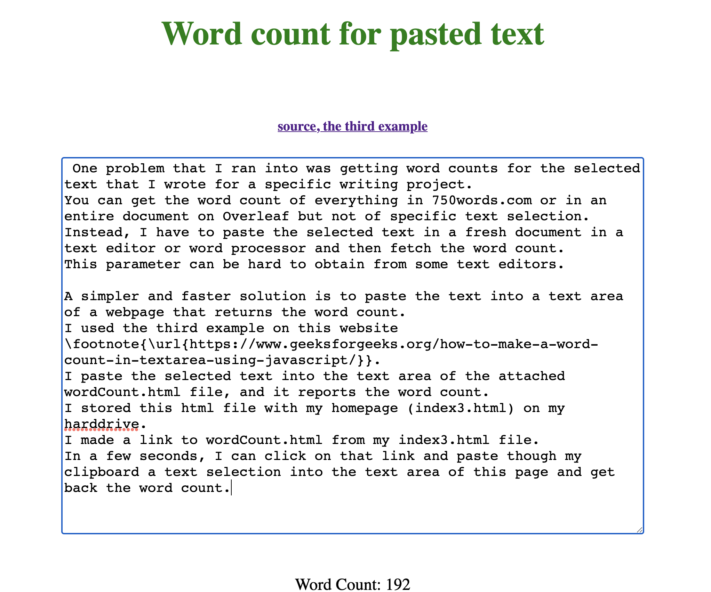

[](https://opensource.org/licenses/MIT)

# writingProgress2022
## Workbook to track progress on writing projects with automated bar plots

### Synopsis
The attached Open Office Document (WritingProgress2022tenProjectsTest.ods) can be imported into Google Sheets, where it was created. You can also open this document in Libre Office or Open Office for offline use. After spending 20-60 minutes customizing the workbook for your current and planned writing projects, you should be set for tracking your writing progress for 2022. It should take no more than a minute a day to make the entries and to check on your monthly progress displayed as bar plots, as shown below. Version 0.2 has the counts displayed at the right end of the bars.

<p align="center"></p>


### Details

My writing projects are generally too large to finish in a day, week, or month, let alone a year.
I find that tracking my writing progress helps me to sustain my writing efforts.
The simplest way to do this is to track the lump sum number of words written for the day, minutes spent, or both.

I track both because often a lot of other work has to be done other than generating new words.
I display these values side-by-side with my goal in bar plots.
When one or both parameters exceed my goals, I get a sense of satisfaction.
When one or both parameters are lagging behind my goal, I redouble my efforts.
The bar plots display the progress by month because the bar plots become too unwieldy for longer periods of time.
Having to start over at zero at the start of each month is admittedly depressing, but it is also a chance to renew your commitment to your writing goals.
One alternative would be to display the progress by semester.

Below are real examples from May 2020. 
Note how I exceeded the time goal while lagging behind on the word goal.
Word count is not enough to track real progress made on vital non-generative writing activities related to the writing project.
This my beef with many writing guides for academics is that they suggest that tracking word count is sufficient. 
A small minority of the effort behind an academic paper in the physical and biological sciences is the generation of new text. 

<p align="center"></p>

<p align="center"></p>

I created a workbook of spreadsheets in Google Sheets to do the above progress tracking.
This workbook started out as an Excel workbook about five or six years ago.
I fondly recalled a period when I used it daily for several months, and I made some real progress.
I moved it to Google Sheets three years ago and made a massive revision to the layout to include the tracking of time spent because it was not enough to track words written.
I store this workbook on my Google Drive.
I add a link to this workbook to the top row of my private homepage, so I can reach this workbook with the click of a link.

You can also make a bash alias to open the workbook in a webrowser by entering the alias name on the command line.
For example, I open my writing progress workbook in Google Chrome by entering `wpc'. 
I have similar aliases for other browsers like wps for use with Safari and wpf for use with FireFox.
Here is an example of the bash code that can be customized and added to your .bashrc or .zshrc file:

```bash
alias openc="open -a Google\ Chrome.app"
alias wpc='openc https://docs.google.com/spreadsheets/d/<insert workbook specific code>'
```

I created a worksheet for each writing project.
I enter the number of words written and time spent on a given day in the sheet for a specific project.
There is a column for comments where I might describe my accomplishments or problems.
Filling in the comment column is optional.
The tracking of accomplishments should really be done in a writing log for the specific project.
The use of one sheet per project allows me to get sums of either parameter by selecting the appropriate range in a column.
The sum and other statistics are displayed in the lower right hand corner of the workbook.

Please note that there is a column for notes. 
I might have been trying to track my effort on my writing logs. 
I am not using it. 
Ignore it for now. 

The daily entries from each project are automatically summed and stored in the min.day and word.day sheets.
The cumulative sums are automatically displayed by month in the horizonal bar plots along the right margin of the min.day and word.day sheets.
The cumulative sums are shown side-by-side with my goal for each day: 240 minutes and 1000 words.

I selected 240 minutes because this is the maximum amount of time that professional writers spend a day generating new text.
Of course, you can spend 720 minutes in a day on the writing related tasks of figure making or data analysis.
You can also make steady progress with as little as 20 minutes a day, especially if you have only one writing project.

I selected 1000 words per day as a goal because higher goals like 2000 words per day drove me to write too much text, most of which I will never publish. 
As a result of this excess writing, I was spending less time on the important non-generative writing related tasks like making figures, editing the text, reading related papers, data analysis, and the many other activities that advance a writing project.
The average academic paper is 5000 words, so I should be able to finish one paper a week. 
I wish.
This would be possible if I had a lab with 50 workers.
There is a lot more to preparing scientific manuscripts than generating text.

You can adjust these daily goals by editing the appropriate columns in the min.day and word.day sheets.
500 words and 120 minutes per day may be more realistic goals for beginners; it depends on what works for you.
The right values are the ones that help your sustain your productivity. 
That is all that matters.

The workbook is set up for 2022.
I will try to remember to make a new workbook for 2023.
Otherwise, the 2022 notebook can be extended to 2023 and beyond if you want to track your effort on projects that span several years.
You can duplicate rows 1-366 and edit them appropriatley.
Alternatively, you can make a copy of a blank version of this workbook and edited it for a fresh start at the beginning of 2023.

I have included only ten projects in this demo workbook so that it is not overwhelming.
To customize the workbook with project names, you have to relabel the project sheets and column day in the min.day and word.day sheets.
The cell formulas in the min.day and word.day sheets will update automatically with changes in the sheet name.

To add more writing projects, duplicate a sheet and rename it.
Then add a column for that project in the min.day and word.day sheets and insert the correpsonding cell formulas in this column in both sheets.
See the formulas in the existing columns for guidance.
The parameter values for the plots do not have to be adjusted.

Most advanced academics have one to several dozen active and quiescent writing projects in the form of grant applications, research papers, review articles, seminars, books, and so on.
The presence of ten or more project sheets hinders finding the correct sheet to enter the daily progress by just looking at the names of the sheets along the bottom of the work book.

Alternatively, click on the four horizontal bar icon in the lower lefthand corner.
This will open a scroll menu that you can use to quickly select the appropriate project.
See the image below.
I recommend this approach when the number of tabs becomes too large for all of them to be seen at once.

<p align="center"></p>

To cope with this problem of finding the correct project, you can also zoom out on the workbook to shrink the size of the tabs at the bottom of the workbook so that more tabs are displayed. 
You can also color code the tabs by the category of the writing project.

I use a project indexing scheme that is mapped to the project's directory on my computer, to the writing project in the Overleaf web-service, and to a Google calendar dedicated to a project.
I sometimes forgotten what the project number and name represents. 
This is a common problem when working on related writing projects in parallel.
To refresh your memory, you can read the parameters and values fields to the right of the comments field in a project's sheet to enter the project's meta data like title, directory name, and so on.
See the example below:

<p align="center"></p>

The project indices are clustered by project type which also aids finding the correct sheet quickly.
For example, manuscripts start with index 001 and grant applications start with index 1001.
You can change the order of the tabs; this action will not impact the sums in the words.day and min.day sheets or the generation of the bar plots.

The keys to sustaining the use of this workbook are (1) to make it rapidly accessible via a link or alias and (2) to ease the finding of the specific writing project sheet in which to enter the number of words written, minutes spent, or both.
The latter problem can be addressed by using a color code for the active writing projects.

Keeping the labels for writing projects as short as possible allows for the display of more tabs. 
At the default zoom level, you can see about 15 tabs.
You can still read the labels for fifty tabs when zoomed out sufficiently.
I am now using the scroll menu in the lower lefthand corner to find the project sheet to open.
I shortened the writing project sheet name to the project's index number, and I now rely on the metadata in the sheet to check that I have opened the correct sheet.
I usually have the project number at the front of my mind when working on a writing project, but metadata in the sheet is a good sanity check.
Enter the `end' key of an extended keyboard to move to the end of a row to display the monthly plots along the right margin of the min.day and word.day sheets. 

I have taken care of the other barrier to using the workbook, which is the coding of the monthly bar plots.
This task can be tedious and has deterred me from using the workbook in the past when I was using Excel to edit the workbook off line.
I had trouble recalling how to edit the data ranges at the start of each month. 
Fear of expending effort on this task set up a motivation barrier.
I have since found that the setting up of the plots is easier in Google Sheets than in Excel.
I also find it to be more efficient to do the plot setups all at once for the entire year.

### Word count of selected text

One problem that I ran into was getting word counts for the selected text that I just wrote for a specific writing project.
You can get the word count of everything in 750words.com or in an entire document on Overleaf but not of specific text selection.
On Overleaf, you have to remember to get the word count at the start and end of a writing session to get the net number of words added.

A simpler and faster solution is to paste the freshly written text into a text area of a webpage that returns the word count.
I paste the selected text into the text area of the above wordCount.html file, and it reports the word count.
I stored this html file with my private homepage (index3.html) on my harddrive.
I made a link to wordCount.html from my index3.html file.
In a few seconds, I can click on that link and paste from my clipboard a text selection into the text area of this page and get back the word count. 
The result of doing so with an earlier version of the first three paragraphs of this README.md is shown below.

<p align="center"></p>

Reload the webpage to clear the textarea of text and prepare it for pasting in new text.
One advantage of the textarea is that typos can be detected with the appropriate extensions added to your browser.
