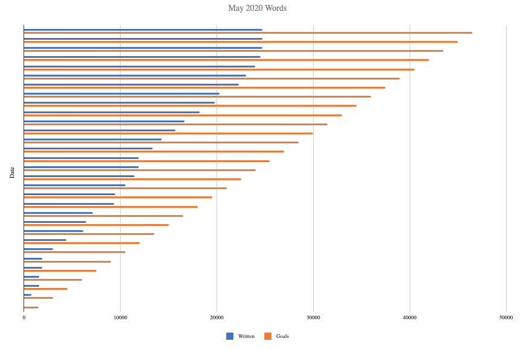

# writingProgress2022
## Workbook to track progress on writing projects with automated bar plots

### Synopsis
The attached Open Office Document (WritingProgress2022tenProjectsTest.ods) can be imported into Google Sheets where it was created.
You can also open this docment in LibreOffice for off-line use.
After spending 20-60 minutes customizing the workbook for your current and planned writing projects, 
you should be set for tracking your writing progress for 2022.

### Details

My writing projects are generally too large to finish in a day, week, or month, let alone a year.
I find that tracking my writing progress helps me to sustain my writing efforts.
The simplest way to do this is to track the lump sum number of words written for the day, minutes spent, or both.
I track both because often a lot of other work has to be done other than generating new words.

I like to display these values side-by-side with my goal in bar plots.
When one or both parameters exceed my goals, I get a sense of satisfaction.
When one or both parameters are lagging behind my goal, I redouble my efforts.
The bar plots display the progress by month because the bar plots become too unwieldy for longer periods of time.
Having to start over at zero at the start of each month is depressing, but it is also a chance to renew your commitment to your writing goals.
One alternative would be to display the progress by semester.

Below are real examples from May 2020. 
Note how I exceeded the time goal while lagging behind on the word goal.
Word count is not enough to track real progress made on vital non-generative writing activities related to the writing projects.
This my beef with writing guides that suggest that tracking word count is sufficient. 
A small minority of the effort behind an academic paper in the physical and biological sciences is the generation of new text. 

<p align="center"></p>

<p align="center"></p>

I created a workbook to do the above.
It should take only a minute a day to make the entries and to check on your monthly progress.

This workbook started out as an Excel workbook about five or six years ago.
I fondly recalled a period when I used it daily for several months and I made some real progress.
I moved it to Google Sheets three years ago.

I stored this workbook on my Google Drive.
I added a link to this workbook to the top row of my private homepage, so I can reach this workbook with the click of a link.

You can also make a bash alias to open the workbook in a webrowser by entering the alias name on the command line.
For example, I open my writing progress workbook by entering `bwp' for Blaine's writing progress. 
Here is an example of the bash code that can be customized and added to your .bashrc or .zshrc file:

```bash
alias openc="open -a Google\ Chrome.app"
alias bwp='openc https://docs.google.com/spreadsheets/d/<insert workbook specific code>'
```

I added a layer of complexity by creating a worksheet for each writing project.
I enter the number of words written and time spent on a given day in the sheet for a specific project.
There is a column for comments where I might describe my accomplishments or problems.
Filling in this column is optional.
The use of one sheet per project allows me to get sums of both parameters by selecting the appropriate range in a column.
The sum and other statistics are displayed in the lower right hand corner of the workbook.

Please note that there is a column for notes. I think that I might have been trying to track my effort on my writing logs. I am not using it. Ignore it for now. 

The daily entries from each project are automatically summed and stored in the min.day and word.day sheets.
The cumulative sums are automatically displayed by month in bar plots along the right margin of the min.day and word.day sheets.
The cumulative sums are shown side-by-side with my goal for each day: 240 minutes and 1000 words.
I choose 240 minutes because this is the maximum amount of time that professional writers spend a day generating new text.
Of course, you can spend 720 minutes in a day on the writing related tasks of figure making or data analysis.
You can also make steady progress with as little as 20 minutes a day, especially if you have only one writing project.
I choose 1000 words a day because higher goals like 2000 words a day drove me to write too much text, most of which I will never publish. 
As a result of this excess writing, I was spending less time on the important non-generative writing related tasks like making figures, editing the text, reading related papers, data analysis, and the many other activities that advance a writing project.

You can adjust these daily goals by editing the appropriate columns in the min.day and word.day sheets.
500 words and 120 minutes per day may be more realistic goals for beginners; it depends on what works for you.
That is all that matters.

The workbook is set up for 2022.
It can be extended to 2023 and beyond if you want to track your effort on projects that span several years.
Alternatively, you can make a copy of the new version of this workbook and edited it for a fresh start at the beginning of 2023, if I fail to remember to post a fresh copy for 2023.

I have included only ten projects in this demo workbook so that it is not overwhelming.
To customize the workbook with project names, you have to relabel the project worksheets, column names, and the formulas in the min.day and word.day sheets.
To add more writing projects, duplicate a sheet and rename it.
The formulas in the min.day and word.day sheets will update automatically.
The code for the plots will not have to be adjusted.

Most advanced academics have one to several dozen active and quiescent writing projects in the form of grant applications, research papers, review articles, seminars, and so on.
The presence of ten or more project sheets hinders finding the correct sheet to enter the daily progress.
This search can take longer than making the daily entry.

To cope with this problem, you can zoom out on the workbook to shrink the size of the tabs at the bottom of the workbook so that more tabs are displayed. 
In addition, you can cluster writing projects by category, like all grant applications.
You can also color code the tabs by the category of the writing project.

I have started using a project indexing scheme that is mapped to the project's directory on my computer and to the writing project on Overleaf so that I can triple-check the identity of the project if I have forgotten what the name of the project represents. 
This is a common problem when working on related writing projects in parallel.
The project indices are clustered by project type which also aids finding the correct sheet quickly.
For example, grant applications start with index 1001 and manuscripts start with index 001.
Five grant applications are listed first followed by five manuscripts in the min.day and word.day sheets because the grant applications are more urgent.

Some other mistakes that I have made included tracking my exercise activity and the other kinds of daily progress in the same workbook.
It is better to keep the scope of the workbook narrowed to tracking writing progress.

The keys to sustaining the use of this workbook are (1) to make it rapidly accessible via a link or alias and (2) to ease the finding of the specific writing project sheet in which to enter the number of words written, minutes spent, or both.
The latter problem can be addressed by moving the tabs of the current writing projects to the left side of the workbook or by using a color code for the active writing projects.

Both approaches have their drawbacks when there are numerous writing projects and some of the writing project sheet tabs are hidden.
The hidden tabs are displayed by clicking on the arrow in the lower right.
Keeping the labels for writing projects as short as possible allows for the display of more tabs. 
At the default zoom level, you can see about 15 tabs.

I shortened the writing project titles to the project's index number while retaining the full name in the column labels of the min.day and word.day sheets because the width of these sheets does not matter.
You can still read the labels for fifty tabs when zoomed out sufficiently.
I usually have the project number at the front of my mind when working on a writing project, but the description in the column label can serve as a reminder. 
You can also add the project's full title or a list of potential titles to an unused column in the project sheet.
Enter the "end" key of an extended keyborad to move to the end of a row to display the monthly plots along the right margin of the min.day and word.day sheets. 

If you shorten the titles of the sheets, the shortened names will be automatically updated in the cells of the min.day and word.day sheets.
You can shuffle the order of the tabs at the bottom of the workbook without ill effect.
You should be able to do likewise for the project columns of the min.day and word.day sheets.

I have taken care of the other barrier to using the workbook, which is the coding of the monthly bar plots.
This task can be tedious and which has deterred me from using the workbook in the past when I was using Excel to edit the workbook off line.
I had trouble recalling how to edit the data ranges at the start of each month. 
I have since found that the setting up of the plots is easier in Google Sheets than in Excel.
I also find it to be more efficient to do the plot setups all at once for the entire year.
